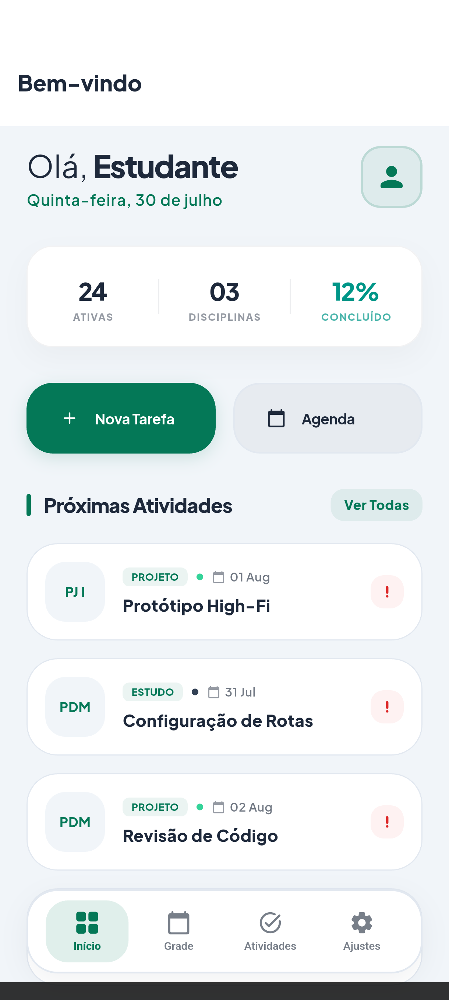
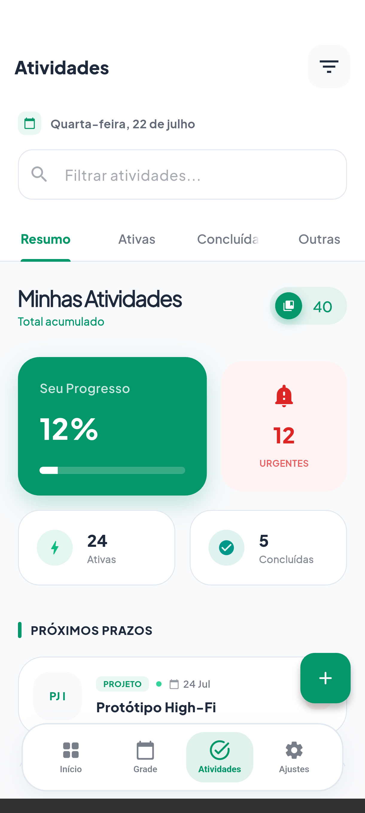
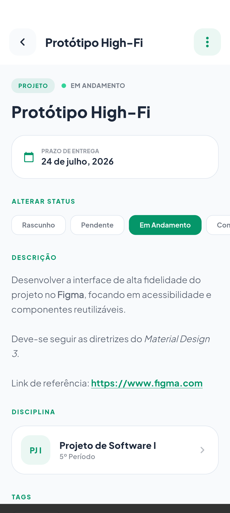
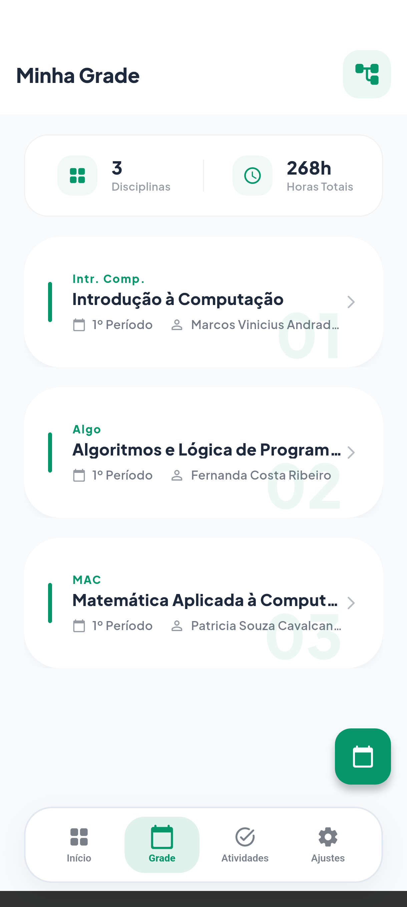
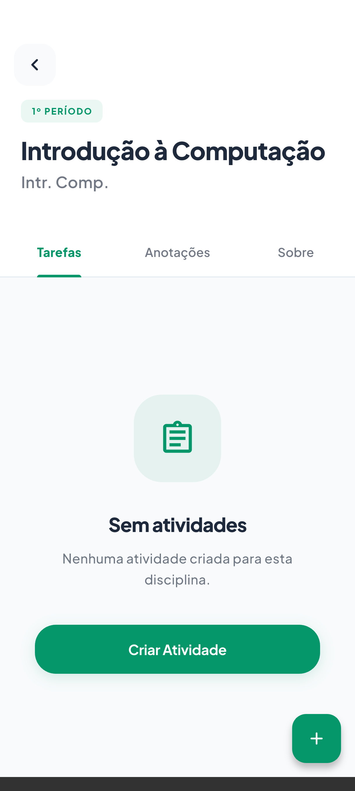
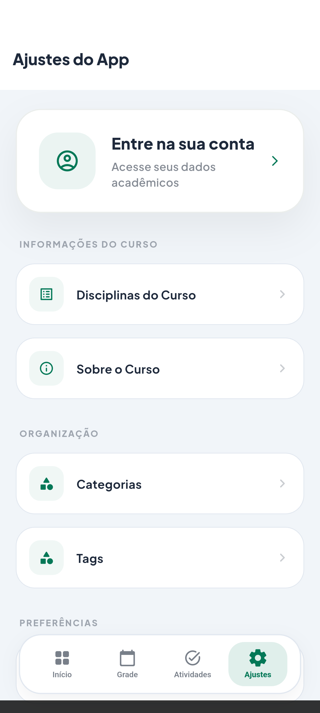
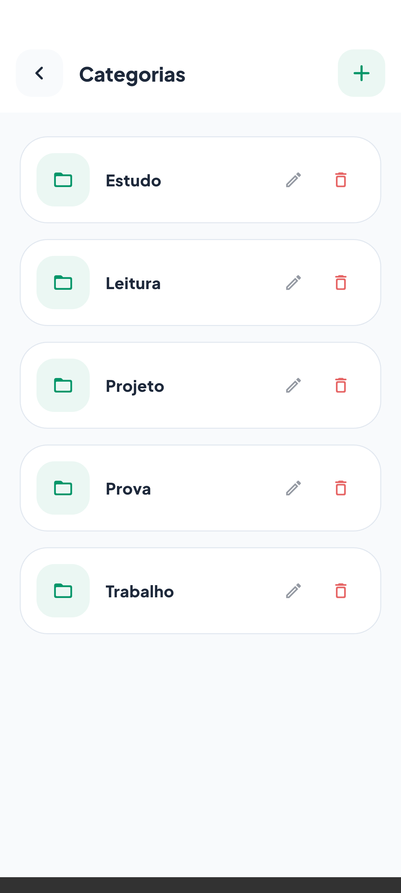
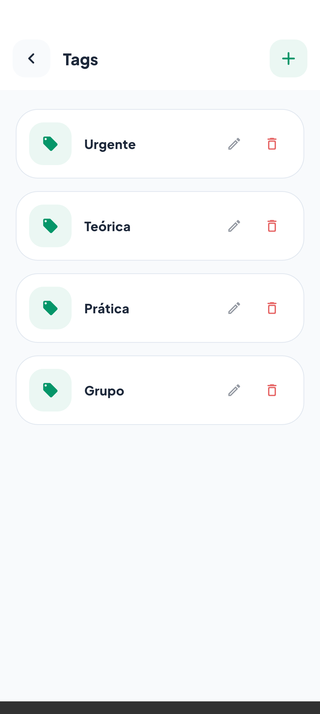

<br>
<div align="center">


</div>
<br>

<p align="center">
<strong>English</strong> · <a href="README.pt-BR.md">Português (BR)</a> · <a href="README.es.md">Español</a>
</p>

<h1 align="center">Academic Planner</h1>

<p align="center">
Reference project for <strong>MVVM + Clean Architecture + Feature-First</strong> architecture in Flutter.
<br>
<a href="#about-the-project"><strong>Explore the docs »</strong></a>
<br>
<br>
<a href="https://github.com/dariomatias-dev/academic-planner/issues">Report Bug</a>
·
<a href="https://github.com/dariomatias-dev/academic-planner/issues">Request Feature</a>
</p>

## Table of Contents

- [About the Project](#about-the-project)
- [Preview](#preview)
- [Features](#features)
- [Tech Stack](#tech-stack)
- [Architecture](#architecture)
- [Getting Started](#getting-started)
- [Scripts](#scripts)
- [Testing](#testing)
- [Documentation](#documentation)
- [Contributing](#contributing)
- [Security](#security)
- [License](#license)
- [Author](#author)

## About the Project

Academic Planner is a student routine management application that serves as an **architectural reference project**. The main goal is not just the functionality itself, but to demonstrate how to structure a medium/large Flutter application using:

- **Feature-First**: code organization by business domain
- **Clean Architecture**: separation of concerns into layers with explicit dependency rules
- **MVVM**: decoupling between UI and presentation logic

Every architectural decision is documented with its rationale. The project is intentional: there are no shortcuts that compromise the structure to gain development speed.

## Preview

<div align="center">










</div>

## Features

| Feature             | Description                                                                               |
| ------------------- | ------------------------------------------------------------------------------------------- |
| Activities          | Create, edit, and delete academic activities with filters by status, date, and discipline |
| Disciplines         | Manage disciplines by academic period with schedule and teacher details                   |
| Agenda              | Calendar view with activities grouped by date                                             |
| Notes               | Rich text editor for creating notes linked to disciplines                                 |
| Schedule            | Weekly class schedule grid view                                                           |
| Categories and Tags | Organize activities with custom categories and tags                                       |
| Authentication      | Sign in, sign up, and password recovery via Firebase Auth                                 |
| Settings            | Light/dark theme toggle with local persistence                                            |
| About               | App info with version and source code link                                                |

## Tech Stack

| Role              | Technology                                              |
| ------------------ | ----------------------------------------------------------- |
| Framework         | Flutter 3.44.9, Dart SDK ^3.12.2                        |
| State & DI        | flutter_riverpod                                        |
| Local persistence | sqflite (SQLite), shared_preferences                    |
| Backend & Auth    | firebase_auth, google_sign_in, cloud_firestore           |
| Navigation        | go_router                                                |
| Rich UI           | flutter_quill, syncfusion_flutter_calendar, google_fonts |

> Every dependency with its exact resolved version and role: [docs/architecture.md](docs/architecture.md#technologies)

## Architecture

Feature-First + Clean Architecture + MVVM. Each feature under `lib/src/features/<feature>/` has its own `domain/` (pure Dart, zero dependencies), `data/`, `presentation/` and `di/` layers, and no feature imports another feature's `presentation/`:

```
Screen -> Provider -> ViewModel -> Repository (contract) -> RepositoryImpl -> DataSource
```

> Full explanation with code examples, the annotated folder tree, and the GoRouter navigation system: [docs/architecture.md](docs/architecture.md)

## Getting Started

### Prerequisites

- Flutter 3.44.9+ (pinned via [fvm](https://fvm.app/), see `.fvmrc`)
- Dart SDK ^3.12.2
- Firebase project configured (for authentication and Firestore)

### Firebase Setup

The project uses Firebase Authentication (email/password and Google) and Cloud Firestore for user data. With the Firebase project created and connected (see Prerequisites), the following configuration is required in the Firebase Console:

**1. Enable the sign-in providers**

Go to **Authentication → Sign-in method** and enable **Email/Password** and **Google**.

**2. Register the app's SHA-1 fingerprint (required for Google sign-in on Android)**

The Google provider validates the app using its signing certificate fingerprint. Without that fingerprint registered, Google sign-in fails with a generic error, even though the provider is configured as enabled.

1. Get the SHA-1 fingerprint from the debug keystore:
   ```bash
   keytool -list -v -keystore ~/.android/debug.keystore -alias androiddebugkey -storepass android -keypass android
   ```
2. In **Project Settings → your Android app → Add fingerprint**, paste the `SHA1` value.
3. Download the updated `google-services.json` and replace `android/app/google-services.json`.
4. Run `fvm flutter clean && fvm flutter pub get`.

> Before publishing the application, repeat this procedure with the **release** keystore's SHA-1; the debug fingerprint covers local builds only.

**Justification:** until a SHA-1 fingerprint is registered, `google-services.json`'s `oauth_client` array remains empty, and every Google sign-in attempt results in `UnknownFailure`.

### Installation

```bash
# Clone the repository
git clone https://github.com/dariomatias-dev/academic-planner.git
cd academic-planner

# Install dependencies
fvm flutter pub get

# Run the application
fvm flutter run
```

### Development Seeds

Seeds populate the database with sample data for development. Inactive by default, never run in release builds.

```bash
# Run app with seeds on first launch (debug only)
fvm flutter run --dart-define=SEED_ENABLED=true

# Run seeds as a standalone script (no emulator needed)
dart run scripts/seed.dart
```

## Scripts

Utility scripts live under `scripts/`.

| Script       | Command                             | Description                                                                                                                                                       |
| ------------ | ------------------------------------ | ------------------------------------------------------------------------------------------------------------------------------------------------------------------ |
| `seed`       | `dart run scripts/seed.dart`        | Populates the database with sample data for local development (see [Development Seeds](#development-seeds)).                                                    |
| `screenshot` | `scripts/screenshot.sh [device-id]` | Drives the app through its main screens on a connected device or emulator and saves a screenshot of each one into `screenshots/`, used for the README. Run `fvm flutter devices` to list available device ids. |
| `check_coverage` | `scripts/check_coverage.sh <lcov-file> <minimum-percent>` | Fails if line coverage in an lcov report is below the given minimum, excluding generated (`*.g.dart`) files. |
| `verify` | `scripts/verify.sh [--all] [--skip-tests]` | Local verification gate mirroring CI: format, analyze, test and the coverage floor. Scoped to pending changes by default; `--all` checks the whole repository and is skipped if nothing changed since the last successful run (see [The local gate](docs/contributing.md#the-local-gate)). |
| `workspace_hash` | `scripts/workspace_hash.sh` | Prints a hash fingerprinting the workspace's current state (last commit plus pending changes), used by `verify.sh` to detect no-op runs. |

## Testing

```bash
fvm flutter test              # unit and widget tests
fvm flutter test --coverage   # with an lcov coverage report
```

`test/` mirrors `lib/` path-for-path. [test/provider_graph_smoke_test.dart](test/provider_graph_smoke_test.dart) resolves every Riverpod provider in the app against minimal overrides, to catch wiring mistakes a single provider's own test wouldn't. `integration_test/` covers end-to-end flows and drives the screenshots above via `scripts/screenshot.sh`.

```bash
scripts/verify.sh --all
```

runs the same checks as CI — format, analyze, test — and an 80% line coverage floor.

## Documentation

Documentation is organized into separate files by topic for easier navigation:

| Document                              | What you will find                                                                                                                                                                                                     |
| --------------------------------------- | -------------------------------------------------------------------------------------------------------------------------------------------------------------------------------------------------------------------- |
| [Architecture](docs/architecture.md) | MVVM, Clean Architecture and Feature-First with code examples and rationale; the full folder tree; the GoRouter navigation system with a complete route reference; and every dependency with its exact version and role |

## Contributing

Contributions are welcome. See [docs/contributing.md](docs/contributing.md) for the local setup, the pre-PR checklist, and the commit message and branching conventions this project follows:

```bash
scripts/verify.sh --all
```

## Security

Found a vulnerability? Please don't open a public issue — see [docs/security.md](docs/security.md) for how to report it privately.

## License

Distributed under the MIT License. See [LICENSE](LICENSE) for the full text.

## Author

Developed by **Dário Matias**:

- **Portfolio**: [dariomatias-dev](https://dariomatias-dev.com)
- **GitHub**: [dariomatias-dev](https://github.com/dariomatias-dev)
- **Email**: [dariomatias.dev@gmail.com](mailto:dariomatias.dev@gmail.com)
- **Instagram**: [@dariomatias_dev](https://instagram.com/dariomatias_dev)
- **LinkedIn**: [linkedin.com/in/dariomatias-dev](https://linkedin.com/in/dariomatias-dev)
