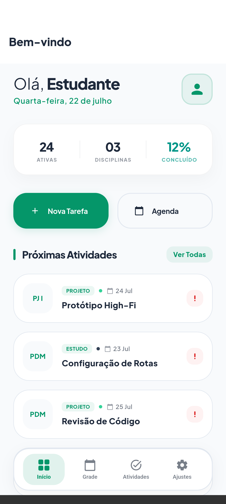
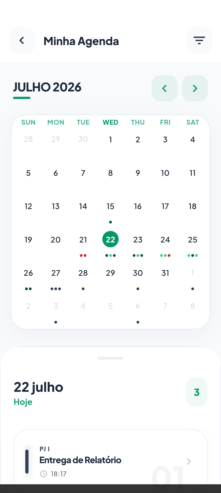
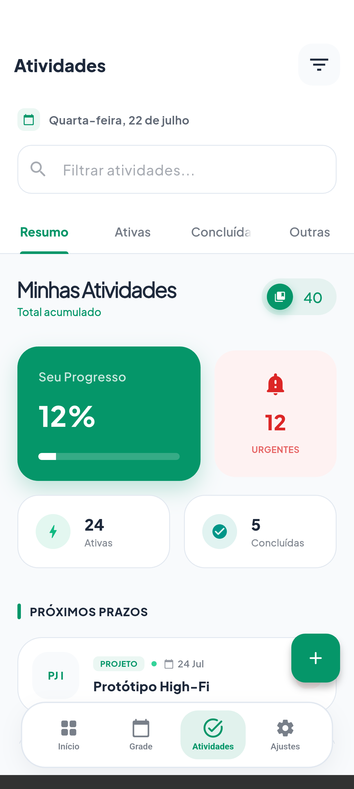
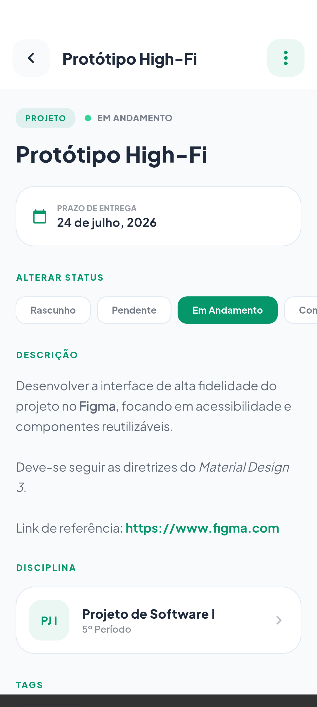
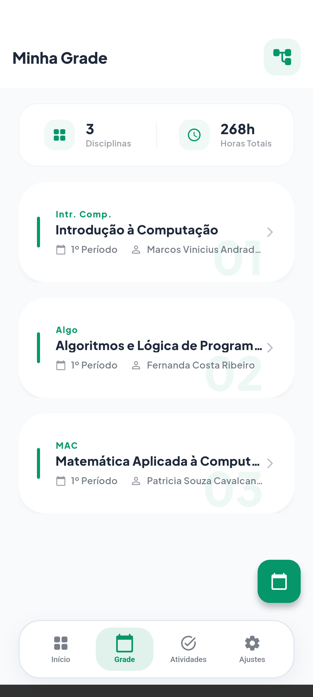
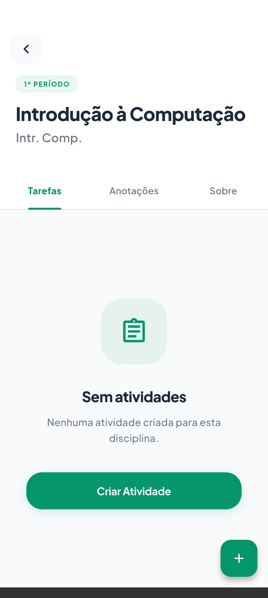
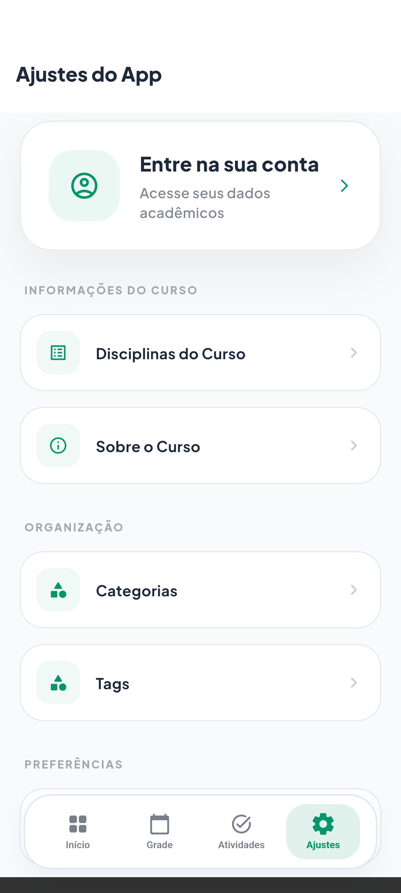
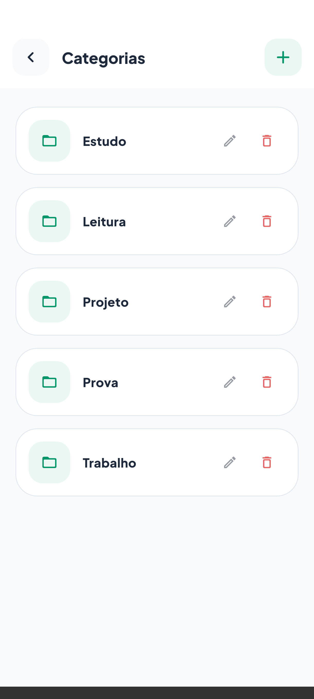
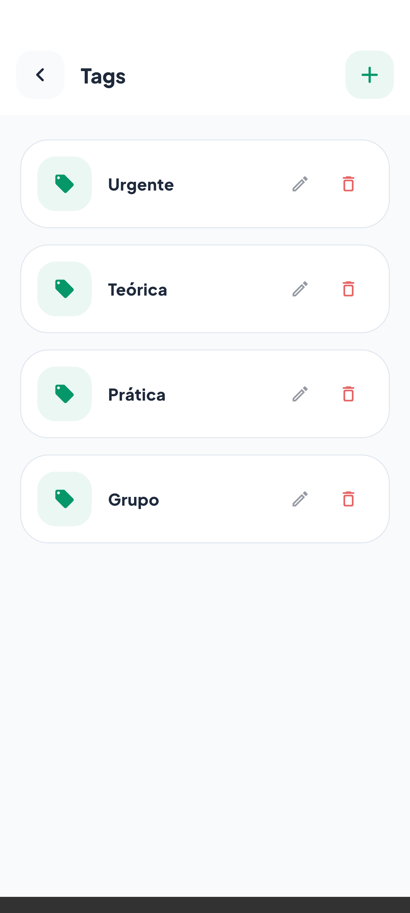
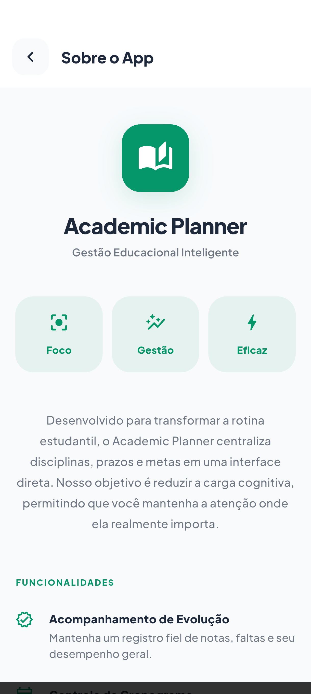

<br>
<div align="center">


</div>
<br>

<p align="center">
<a href="README.md">English</a> · <strong>Português (BR)</strong> · <a href="README.es.md">Español</a>
</p>

<h1 align="center">Planejador Acadêmico</h1>

<p align="center">
Projeto de referência para arquitetura <strong>MVVM + Clean Architecture + Feature-First</strong> em Flutter.
<br>
<a href="#sobre-o-projeto"><strong>Explore a documentação »</strong></a>
<br>
<br>
<a href="https://github.com/dariomatias-dev/academic-planner/issues">Reportar Bug</a>
·
<a href="https://github.com/dariomatias-dev/academic-planner/issues">Solicitar Funcionalidade</a>
</p>

## Sumário

- [Sobre o Projeto](#sobre-o-projeto)
- [Funcionalidades](#funcionalidades)
- [Arquitetura](#arquitetura)
- [Estrutura de Pastas](#estrutura-de-pastas)
- [Tecnologias Principais](#tecnologias-principais)
- [Capturas de Tela](#capturas-de-tela)
- [Primeiros Passos](#primeiros-passos)
- [Scripts](#scripts)
- [Documentação](#documentação)
- [Contribuindo](#contribuindo)
- [Autor](#autor)

## Sobre o Projeto

O Planejador Acadêmico é um aplicativo de gestão de rotina estudantil que serve como **projeto de referência arquitetural**. O objetivo principal não é apenas a funcionalidade em si, é demonstrar como estruturar uma aplicação Flutter de médio/grande porte utilizando:

- **Feature-First**: organização de código por domínio de negócio
- **Clean Architecture**: separação de responsabilidades em camadas com regras de dependência explícitas
- **MVVM**: desacoplamento entre UI e lógica de apresentação

Cada decisão arquitetural está documentada com justificativa. O projeto é intencional: não há atalhos que comprometam a estrutura para ganhar velocidade de desenvolvimento.

## Funcionalidades

| Funcionalidade    | Descrição                                                                                     |
| ----------------- | --------------------------------------------------------------------------------------------- |
| Atividades        | Criação, edição e exclusão de atividades acadêmicas com filtros por status, data e disciplina |
| Disciplinas       | Gerenciamento de disciplinas por período com detalhes de horário e professor                  |
| Agenda            | Visão de calendário com atividades agrupadas por data                                         |
| Anotações         | Editor rich text para criação de notas vinculadas a disciplinas                               |
| Grade de Horários | Visualização da grade semanal de aulas                                                        |
| Categorias e Tags | Organização de atividades por categorias e tags personalizadas                                |
| Autenticação      | Login, cadastro e recuperação de senha via Firebase Auth                                      |
| Configurações     | Alternância de tema claro/escuro com persistência local                                       |
| Sobre             | Informações do app com versão e link para o código-fonte                                      |

## Arquitetura

O projeto combina três abordagens complementares:

```
Feature-First  ->  como o código é organizado em pastas
Clean Arch     ->  como as camadas se comunicam (regras de dependência)
MVVM           ->  como a UI se conecta à lógica de negócio
```

### Por que essas três?

**Feature-First** resolve o problema de organização: em vez de agrupar arquivos por tipo técnico (todos os models juntos, todas as telas juntas), agrupa por domínio de negócio. Cada feature é um módulo isolado - alterar `activities` não exige abrir pastas de outras funcionalidades.

**Clean Architecture** resolve o problema de dependências: define regras explícitas sobre qual camada pode depender de qual. O Domain (regras de negócio) é Dart puro, sem dependências externas. A UI nunca acessa o banco de dados diretamente.

**MVVM** resolve o problema de acoplamento na UI: a tela nunca contém lógica. O ViewModel gerencia o estado da tela sem depender de `BuildContext` - é testável isoladamente.

Dentro de cada feature:

```text
features/activities/
├── domain/          # Entidades e contratos (Dart puro, zero dependências)
├── data/            # Models, datasources e implementações dos repositórios
├── presentation/    # Screens, ViewModels, Providers e Widgets
└── di/              # Injeção de dependência da feature
```

Fluxo de dados:

```
Screen -> Provider -> ViewModel -> Repository (contrato) -> RepositoryImpl -> DataSource
```

> Documentação completa com exemplos de código: [docs/pt/arquitetura.md](docs/pt/arquitetura.md)

## Estrutura de Pastas

```text
lib/src/
├── core/        # Infraestrutura global (banco, rotas, tema, DI, logging, seeds)
├── features/    # 17 módulos de negócio isolados
└── shared/      # Design System e utilitários globais
```

Features existentes: `about`, `activities`, `auth`, `calendar`, `categories`, `course_details`, `disciplines`, `home`, `notes`, `not_found`, `pdf_viewer`, `schedule`, `settings`, `splash`, `tags`, `teacher`, `users`.

> Árvore completa comentada com detalhamento de cada pasta: [docs/pt/estrutura.md](docs/pt/estrutura.md)

## Tecnologias Principais

| Tecnologia       | Versão  | Papel                        |
| ---------------- | ------- | ---------------------------- |
| Flutter          | 3.35.0  | Framework UI                 |
| Dart SDK         | ^3.10.4 | Linguagem                    |
| flutter_riverpod | 3.3.1   | Gerenciamento de estado e DI |
| go_router        | 17.1.0  | Navegação declarativa        |
| sqflite          | 2.4.2   | Persistência local (SQLite)  |
| firebase_auth    | 6.4.0   | Autenticação                 |
| cloud_firestore  | 6.3.0   | Backend em nuvem             |
| flutter_quill    | 11.5.0  | Editor rich text             |

> Lista completa com versões exatas e justificativa de cada escolha: [docs/pt/tecnologias.md](docs/pt/tecnologias.md)

## Capturas de Tela

<div align="center">










</div>

## Primeiros Passos

### Pré-requisitos

- Flutter 3.35.0+
- Dart SDK ^3.10.4
- Projeto Firebase configurado (para autenticação e Firestore)

### Configuração do Firebase

O projeto usa Firebase Authentication (e-mail/senha e Google) e Cloud Firestore para dados de usuário. Com o projeto Firebase criado e conectado (ver Pré-requisitos), as configurações a seguir devem ser feitas no Console do Firebase:

**1. Habilitar os provedores de login**

Acesse **Authentication → Sign-in method** e habilite os provedores **E-mail/senha** e **Google**.

**2. Cadastrar a fingerprint SHA-1 do app (obrigatório para o login com Google no Android)**

O provedor Google valida o app pela fingerprint do certificado de assinatura. Sem essa fingerprint registrada, o login com Google falha com um erro genérico, ainda que o provedor esteja configurado como habilitado.

1. Obtenha a fingerprint SHA-1 da keystore de debug:
   ```bash
   keytool -list -v -keystore ~/.android/debug.keystore -alias androiddebugkey -storepass android -keypass android
   ```
2. Em **Project Settings → seu app Android → Add fingerprint**, insira o valor de `SHA1`.
3. Faça o download do `google-services.json` atualizado e substitua `android/app/google-services.json`.
4. Execute `flutter clean && flutter pub get`.

> Antes de publicar o aplicativo, repita este procedimento com a SHA-1 da keystore de **release**; a fingerprint de debug cobre apenas builds locais.

**Justificativa:** até que uma fingerprint SHA-1 seja registrada, o array `oauth_client` do `google-services.json` permanece vazio, e toda tentativa de login com Google resulta em `UnknownFailure`.

### Instalação

```bash
# Clone o repositório
git clone https://github.com/dariomatias-dev/academic_planner_app.git

# Instale as dependências
flutter pub get

# Execute o aplicativo
flutter run
```

### Seeds de Desenvolvimento

Seeds populam o banco com dados de exemplo para desenvolvimento. Inativas por padrão, nunca executam em builds de release.

```bash
# Rodar o app com seeds no primeiro launch (somente debug)
flutter run --dart-define=SEED_ENABLED=true

# Rodar seeds como script standalone (sem emulador)
dart run scripts/seed.dart
```

## Scripts

Scripts utilitários ficam em `scripts/`.

| Script       | Comando                             | Descrição                                                                                                                                                    |
| ------------ | ------------------------------------ | -------------------------------------------------------------------------------------------------------------------------------------------------------------- |
| `seed`       | `dart run scripts/seed.dart`        | Popula o banco com dados de exemplo para desenvolvimento local (ver [Seeds de Desenvolvimento](#seeds-de-desenvolvimento)).                                 |
| `screenshot` | `scripts/screenshot.sh [device-id]` | Percorre as principais telas do app em um dispositivo ou emulador conectado e salva uma captura de cada uma em `screenshots/`, usadas no README. Rode `fvm flutter devices` para listar os ids de dispositivos disponíveis. |

## Documentação

A documentação está organizada em arquivos separados por tema para facilitar a navegação:

| Documento                                    | O que você encontra                                                                                                                         |
| -------------------------------------------- | ------------------------------------------------------------------------------------------------------------------------------------------- |
| [Arquitetura](docs/pt/arquitetura.md)        | Explicação detalhada de MVVM, Clean Architecture e Feature-First, com exemplos de código do próprio projeto e justificativa de cada escolha |
| [Estrutura do Projeto](docs/pt/estrutura.md) | Árvore de pastas completa e comentada, detalhamento de cada seção e tabela com todas as features existentes                                 |
| [Navegação](docs/pt/navegacao.md)            | Como o sistema de rotas funciona com GoRouter, referência completa de rotas e guia para adicionar novas                                     |
| [Tecnologias](docs/pt/tecnologias.md)        | Todas as dependências com versões exatas (do `pubspec.lock`) e motivo de cada escolha                                                       |

## Contribuindo

Contribuições tornam a comunidade de código aberto um lugar excelente para aprender e criar. Toda contribuição é bem-vinda.

Antes de abrir um pull request, consulte o [CONTRIBUTING.md](CONTRIBUTING.md) para o setup local, a convenção de mensagens de commit (Conventional Commits) e as regras de branching deste projeto.

## Autor

Desenvolvido por **Dário Matias**:

- **Portfólio**: [dariomatias-dev](https://dariomatias-dev.com)
- **GitHub**: [dariomatias-dev](https://github.com/dariomatias-dev)
- **Email**: [dariomatias.dev@gmail.com](mailto:dariomatias.dev@gmail.com)
- **Instagram**: [@dariomatias_dev](https://instagram.com/dariomatias_dev)
- **LinkedIn**: [linkedin.com/in/dariomatias-dev](https://linkedin.com/in/dariomatias-dev)
